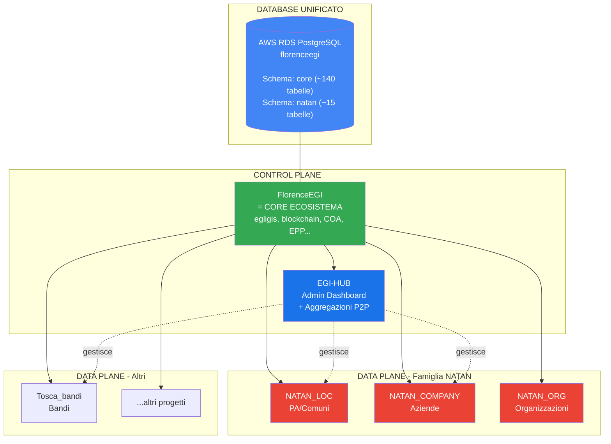

# 🏗️ EGI Platform Architecture v2.0

> **Versione**: 2.0  
> **Data**: 2026-01-07  
> **Autore**: Fabio Cherici + Antigravity AI  
> **Stato**: Approvata

---

## 📊 Visione Generale



---

## 🎯 Cambiamenti Chiave (v1 → v2)

| Aspetto | v1 (Vecchia) | v2 (Nuova) |
|---------|--------------|------------|
| **Database** | Multi-DB (MariaDB, PostgreSQL separati) | **DB Unificato** AWS RDS PostgreSQL |
| **FlorenceEGI** | Uno dei progetti | **= CORE ecosistema** |
| **NATAN** (federation layer) | Progetto separato | **DEPRECATO** (assorbito in EGI-HUB) |
| **Aggregazioni** | Via NATAN | **Dirette in EGI-HUB** (P2P) |
| **Schema DB** | Implicito | **Esplicito** (core + natan) |

---

## 🗄️ Architettura Database Unificata

### Connessione AWS RDS

```env
DB_CONNECTION=pgsql
DB_HOST=florenceegi-postgres-dev.c1i0048yu660.eu-north-1.rds.amazonaws.com
DB_PORT=5432
DB_DATABASE=florenceegi
DB_USERNAME=florence_app
```

### Schema PostgreSQL

```
Database: florenceegi
│
├── Schema: core (~140 tabelle)
│   ├── 👤 Users & Auth: users, user_*, personal_access_tokens
│   ├── 🎨 EGI: egis, egi_*, collections, collection_user
│   ├── ⛓️ Blockchain: egi_blockchain, egi_smart_contracts
│   ├── 📜 COA: coa, coa_snapshots, coa_files, coa_signatures, coa_annexes, coa_events
│   ├── 🌱 EPP: epp, epp_projects, epp_transactions
│   ├── 🎨 Traits: trait_categories, trait_types, egi_traits, egi_coa_traits
│   ├── 🔐 RBAC: roles, permissions, model_has_*
│   ├── 📋 GDPR: consent_*, privacy_*, gdpr_*, user_consents
│   ├── 💰 Wallets & Payments: wallets, payment_distributions, invoices, orders
│   ├── 🤖 AI: ai_credits_transactions, ai_feature_pricing, ai_*
│   ├── 🔗 Aggregazioni P2P: aggregations, aggregation_members
│   └── 📊 Audit: user_activities, error_logs
│
├── Schema: natan (~15 tabelle)
│   ├── 🏛️ Tenants: tenants
│   ├── 📄 PA Acts: pa_acts
│   ├── 💬 Chat AI: natan_chat_messages, user_conversations
│   ├── 🧠 Memorie: natan_user_memories
│   ├── 💬 Chat Umana: channels, channel_members, channel_messages
│   └── 📢 Bacheca: bulletin_posts
│
└── Schema: public
    └── migrations, cache, jobs
```

---

## 🔄 Modello P2P "Grappoli"

### Principio Fondamentale

> **"Niente è automatico. Niente è gerarchico. Tutto è consensuale e P2P."**

### Esempio NATAN_LOC (PA)

```
Aggregazione "Comuni Versilia"
├── 🏛️ Comune Viareggio ←→ Comune Camaiore
├── 🏛️ Comune Pietrasanta ←→ Comune Massarosa
└── Condivisione: Chat umana + RAG cross-tenant
```

### Esempio NATAN_COMPANY (Aziende)

```
Aggregazione "XYZ Corp"
├── 🏢 Sede Centrale Milano
├── 🏢 Succursale Roma
├── 🏢 Succursale Napoli
└── Condivisione: Chat umana + RAG cross-tenant
```

**Caratteristiche:**
- Un tenant può appartenere a **N aggregazioni** contemporaneamente
- Aggregazione/disaggregazione **libera e consensuale**
- **No parent-child**: tutti peer

---

## 📦 Ruolo dei Componenti

| Componente | Ruolo | Database |
|------------|-------|----------|
| **FlorenceEGI** | Core ecosistema, tutte le tabelle condivise | `core.*` |
| **EGI-HUB** | Dashboard admin, gestione progetti e aggregazioni | `core.aggregations`, `core.aggregation_members` |
| **NATAN_LOC** | App RAG per PA, tabelle specifiche | `natan.*` + `core.*` (via connection) |
| **NATAN_COMPANY** | App RAG per Aziende | `natan.*` + `core.*` |
| **NATAN** | **⚠️ DEPRECATO** | - |

---

## 🎨 EGI: Il Contenitore Universale

```
                    core.egis
                         │
       ┌─────────────────┼─────────────────┐
       │                 │                 │
   context=             context=          context=
   'pa_document'       'artwork'         'contract'
       │                 │                 │
   NATAN_LOC        FlorenceArtEGI      Notaio App
```

**EGI = Eco + Goods + Invent**
- **Eco**: Contributo ambientale (EPP)
- **Goods**: Valore tangibile
- **Invent**: Innovazione certificata

Ogni progetto usa la stessa tabella `egis` con `context` diverso.

---

## 🔐 Cross-Tenant RAG

### Flusso Query

```
User Query + scope="aggregation:456"
    ↓
Fetch tenant_ids da aggregation_members (status='accepted')
    ↓
MongoDB: tenant_id: {$in: [123, 456, 789]}
    ↓
Risultati da TUTTI i tenant del grappolo
```

### UI Scope Selector

```
🔍 Cerca in: [Solo mio ente ▾]
             [Comuni Versilia]
             [Costa Toscana Turismo]
             [Tutte le mie aggregazioni]
```

---

## 🚀 Prossimi Passi

1. ✅ Documentazione architettura approvata
2. ⬜ Creare migrazioni con schema prefix (`core.`, `natan.`)
3. ⬜ Aggiornare Models con connection/schema corretti
4. ⬜ Deprecare repository NATAN
5. ⬜ Implementare RAG cross-tenant
6. ⬜ UI Context Switcher per scope query

---

## 📋 Nomenclatura Famiglia NATAN

| Codice | Display Name | Target |
|--------|--------------|--------|
| `NATAN_LOC` | NATAN PA | Pubbliche Amministrazioni |
| `NATAN_COMPANY` | NATAN Company | Aziende private |
| `NATAN_ORG` | NATAN Org | Organizzazioni non-profit |

> **Nota**: "LOC" = Local Authority (PA italiana). Nome legacy mantenuto per compatibilità.

---

*Documento approvato - 2026-01-07*
