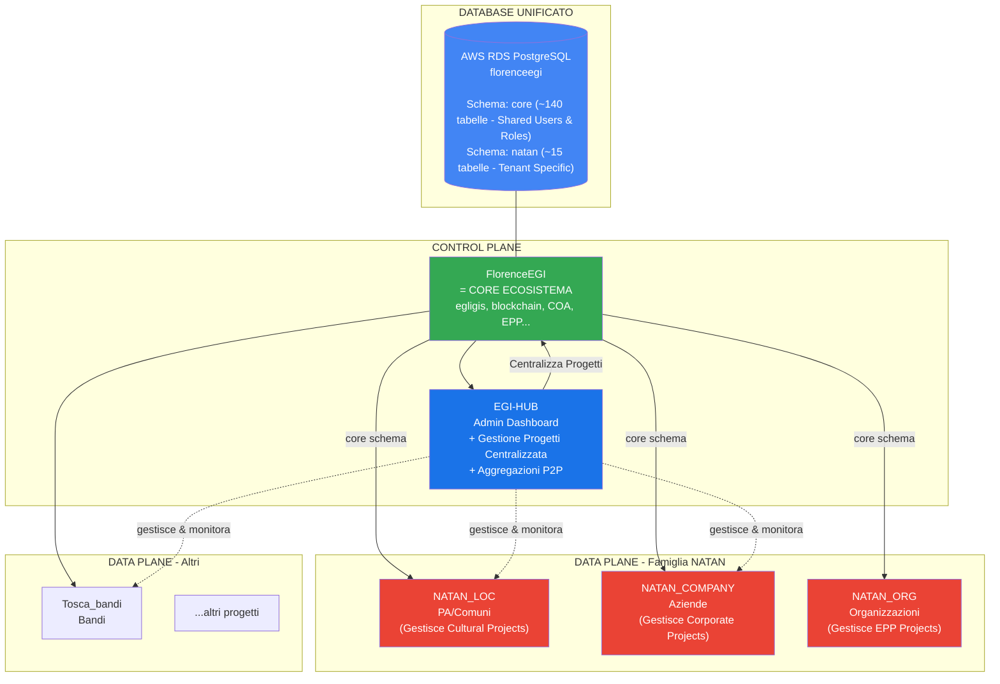
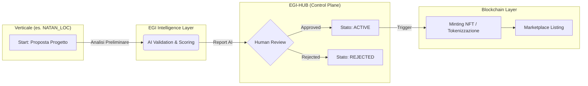

# 🏗️ EGI Platform Architecture v2.1

> **Versione**: 2.1
> **Data**: 2026-01-09
> **Autore**: Fabio Cherici + Antigravity AI
> **Stato**: Approvata
> **Changelog**: Allineamento "Single Source of Truth", Centralizzazione Progetti

---

## 📊 Visione Generale



---

## 🎯 Cambiamenti Chiave (v2.0 → v2.1)

| Aspetto | v2.0 (Precedente) | v2.1 (Attuale) |
|---------|-------------------|----------------|
| **Gestione Identità** | Implicita unificazione | **Single Source of Truth (SSOT)**: `RolesAndPermissionsSeeder` unico in EGI. NATAN_LOC legge da DB condiviso. |
| **Gestione Progetti** | Decentralizzata per app | **Centralizzata in EGI-HUB**: Workflow unificato per EPP, Cultural, Corporate projects. |
| **NATAN_LOC** | App isolata con proprio seeder ruoli (bug) | **Client del DB Unificato**: Usa `core.roles` e `core.users` gestiti dal Control Plane. |
| **Workflow Approvazione** | Non specificato | **Flow Explicit**: Proposta -> AI Valid -> HUB Review -> NFT Minting. |

---

## 🗄️ Architettura Database Unificata: Single Source of Truth

**Principio Fondamentale**: Esiste una sola tabella `users` e una sola tabella `roles` per tutto l'ecosistema. Nessun verticale (LOC, COMPANY) deve avere copie locali o seeder duplicati per queste entità.

### Connessione AWS RDS
Ogni applicazione si connette allo **stesso DB**, cambiando solo il `search_path` per le tabelle specifiche.

```env
# EGI-HUB (Master)
DB_SEARCH_PATH=core,public

# NATAN_LOC (Verticale PA)
DB_SEARCH_PATH=natan,core,public
# NOTA: 'core' è essenziale per vedere users, roles, egis condivisi
```

### Schema PostgreSQL

```
Database: florenceegi
│
├── Schema: core (SHARED - Read/Write da EGI, Read-Only* da Verticali)
│   ├── � Users & Auth: users, model_has_roles, roles, permissions
│   ├── �️ Gestione Progetti: epp_projects, egis (context-aware)
│   ├── 🎨 EGI: collections, trait_*
│   ├── ⛓️ Blockchain: egi_blockchain
│   └── � GDPR: consent_*, privacy_*
│
├── Schema: natan (Vertical Specific)
│   ├── 🏛️ Tenants: tenants (dati specifici app)
│   ├── 💬 Chat AI: natan_chat_messages
│   └── 🧠 Memorie: natan_user_memories
│
└── Schema: public
    └── migrations
```
*\*Read-Only logico: I verticali scrivono su core.egis per i loro progetti, ma non ridefiniscono la struttura.*

---

## 🛠️ Gestione Centralizzata dei Progetti (Project Management)

Tutti i progetti, indipendentemente dall'origine (PA, Azienda, Ente), risiedono nelle tabelle `core` e sono orchestrati da **EGI-HUB**.

### Tipologie e Mappatura

1.  **EPP Projects (Environmental)**
    *   **Source**: NATAN_ORG / EGI Portal
    *   **Tabella**: `core.epp_projects`
    *   **Responsabile**: Ruolo `epp_entity`.
    *   **Output**: Crediti di sostenibilità.

2.  **Cultural Projects (PA/Institutional)**
    *   **Source**: NATAN_LOC
    *   **Tabella**: `core.egis` (con `context='cultural_project'`)
    *   **Responsabile**: Ruolo `pa_entity` (Mario Rossi, et al.).
    *   **Output**: Valorizzazione asset, Crowdfunding.

3.  **Corporate Projects**
    *   **Source**: NATAN_COMPANY
    *   **Tabella**: `core.egis` (con `context='corporate_project'`)
    *   **Responsabile**: Ruolo `company`.
    *   **Output**: CSR, Prodotti Digitali.

### Workflow Unificato



---

## � Modello P2P "Grappoli" (Federation)

> **"Niente è automatico. Niente è gerarchico. Tutto è consensuale."**

I tenant (es. Comune di Firenze) vivono in `natan.tenants` ma collaborano attraverso aggregazioni definite in `core.aggregations`.

```
Aggregazione "Smart City Toscana"
├── 🏛️ Firenze (LOC)
├── 🏢 Public Utilities SpA (COMPANY)
└── 🎓 Università (ORG)
    └── Condivisione: RAG Knowledge Base + Progetti Comuni
```

---

## 📦 Ruolo dei Componenti v2.1

| Componente | Ruolo | Accesso DB |
|------------|-------|------------|
| **FlorenceEGI** | **SSOT** (Single Source of Truth). Gestisce Users, Roles, Core Logic. | `core.*` (Owner) |
| **EGI-HUB** | **Orchestrator**. Dashboard super-admin, approvazione progetti. | `core.*`, `aggregations` |
| **NATAN_LOC** | **Vertical Application**. Interfaccia per PA. Usa ruoli EGI. | `natan.*` (Owner) + `core.*` (Consumer) |
| **NATAN_COMPANY** | **Vertical Application**. Interfaccia per Aziende. | `natan.*` (Owner) + `core.*` (Consumer) |

---

## 📋 Nomenclatura Famiglia NATAN

| Codice | Display Name | Target |
|--------|--------------|--------|
| `NATAN_LOC` | NATAN PA | Pubbliche Amministrazioni |
| `NATAN_COMPANY` | NATAN Company | Aziende private |
| `NATAN_ORG` | NATAN Org | Organizzazioni non-profit |

---

*Documento aggiornato e approvato il 2026-01-09 - v2.1 (Architectural Cleanup Release)*
