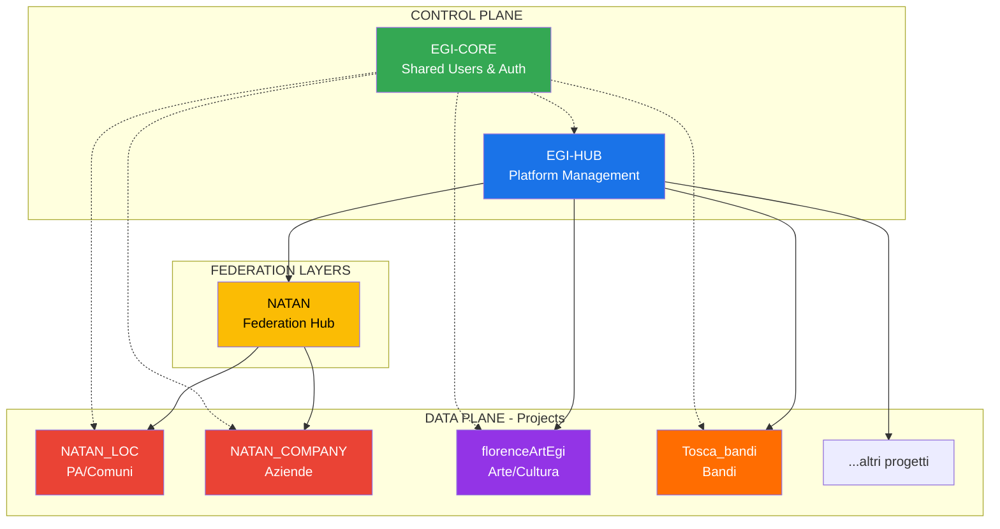
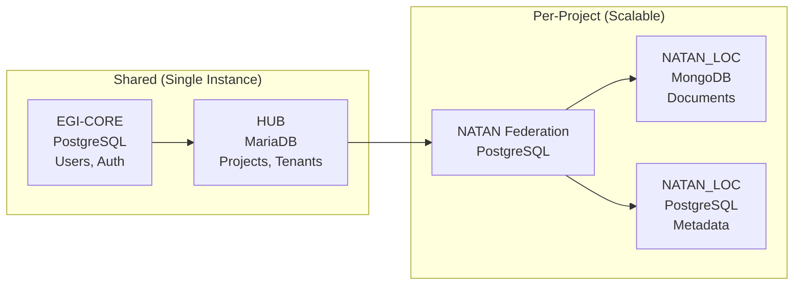

# 🏗️ EGI Platform Architecture

Documento di architettura per l'ecosistema EGI. Pensato per scalare nei prossimi 10+ anni.

---

## 📊 Visione Generale



---

## 🎯 Separation of Concerns

| Layer | Responsabilità | Chi lo usa | Database |
|-------|---------------|------------|----------|
| **EGI-HUB** | Gestione piattaforma, billing, licensing, progetti, tenant | Staff EGI | MariaDB (HUB_EGI) |
| **EGI-CORE** | Utenti centralizzati, autenticazione, SSO | Tutti i progetti | PostgreSQL (fegi_prod) |
| **NATAN** | Aggregazioni cross-tenant per famiglia NATAN_* | Admin tenant | PostgreSQL (natan_federation) |
| **NATAN_LOC** | RAG, chat, bacheca per PA | Utenti PA | MongoDB + PostgreSQL |
| **NATAN_COMPANY** | RAG, chat, bacheca per aziende | Utenti aziende | MongoDB + PostgreSQL |
| **florenceArtEgi** | Gestione opere d'arte, cultura | Utenti cultura | TBD |
| **Tosca_bandi** | Gestione bandi regionali | Utenti bandi | TBD |

---

## 🔄 Flusso di Aggregazione

### NATAN_LOC (PA/Comuni)
```
Aggregazione PREDEFINITA per Regione
├── Voi (staff) create aggregazione "Regione Toscana"
├── Ogni comune aggiunto viene auto-aggregato
└── Utenti comunicano liberamente tra comuni della stessa regione
```

### NATAN_COMPANY (Aziende)
```
Aggregazione SELF-SERVICE per Azienda
├── Admin azienda crea aggregazione "XYZ Corp"
├── Invita/aggiunge le proprie sedi/filiali
└── Solo membri dell'aggregazione possono comunicare
```

---

## 📈 Strategia di Scaling

| Fase | Timeline | Architettura |
|------|----------|--------------|
| **MVP** | Anno 1 | 1 istanza per componente |
| **Growth** | Anno 2-3 | Replica read per DB, CDN, Redis cluster |
| **Scale** | Anno 4-5 | Sharding per regione/cliente grande |
| **Enterprise** | Anno 6+ | Multi-region, disaster recovery, SLA 99.9% |

### Principi di Design

1. **Horizontal over Vertical** - Più server, non server più grandi
2. **Loose Coupling** - Comunicazione via API, non DB condiviso
3. **Stateless Services** - Nessun stato in memoria tra richieste
4. **Tenant Isolation** - Ogni tenant può essere isolato se necessario
5. **Configuration over Code** - Comportamenti configurabili senza deploy

---

## 🗄️ Database Strategy



---

## 🔐 Access Control Matrix

| Ruolo | EGI-HUB | EGI-CORE | NATAN | NATAN_LOC |
|-------|---------|----------|-------|-----------|
| Super Admin (Staff) | ✅ Full | ✅ Full | ✅ Read | ✅ Read |
| Project Admin | ❌ | ✅ Own | ✅ Own Project | ✅ Own Project |
| Tenant Admin | ❌ | ✅ Own | ✅ Own Tenant | ✅ Own Tenant |
| Tenant User | ❌ | ✅ Own | ✅ View | ✅ Own Tenant |

---

## 🚀 Progetti Attuali

| Progetto | Status | Descrizione |
|----------|--------|-------------|
| **EGI-HUB** | 🟡 In sviluppo | Piattaforma centrale |
| **NATAN_LOC** | 🟢 Avanzato | RAG per PA/Comuni |
| **florenceArtEgi** | 🟢 Quasi finito | Gestione opere d'arte |
| **Tosca_bandi** | 🟡 50% | Gestione bandi regionali |
| **NATAN_COMPANY** | ⚪ Pianificato | RAG per aziende |

---

*Ultima modifica: 2026-01-01*
