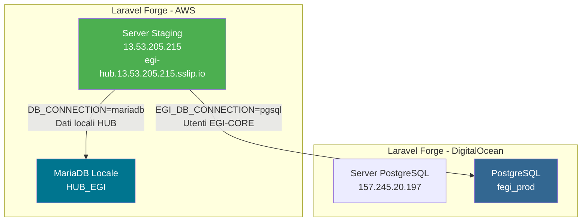

# 🚀 EGI-HUB Staging Deployment - Guida Completa

Questo documento riassume tutti i passaggi necessari per configurare e debuggare il deployment su staging.

---

## 📊 Architettura Infrastruttura



---

## 🔧 Dove Configurare Cosa

### 1. Nginx Configuration (Forge)
**Dove:** Forge → Site → Edit Nginx Configuration

**Cosa controllare:**
- I path devono corrispondere all'IP del server
- Web Directory deve essere `/backend/public`

```nginx
# Frontend React (SPA)
location / {
    root /home/forge/egi-hub.13.53.205.215.sslip.io/current/frontend/dist;
    try_files $uri $uri/ /index.html;
}

# Backend Laravel API
location /api {
    alias /home/forge/egi-hub.13.53.205.215.sslip.io/current/backend/public;
    try_files $uri $uri/ @api;
}
```

> [!IMPORTANT]  
> Se cambi server/IP, devi aggiornare TUTTI i path nella config Nginx!

---

### 2. Firewall PostgreSQL (Forge Network)
**Dove:** Forge → Server `157.245.20.197` → Network

**Cosa fare:**
Aggiungere regola per ogni server che deve accedere al DB:

| Port | Allow From | Descrizione |
|------|------------|-------------|
| 5432 | 13.53.205.215 | Staging server |
| 5432 | (IP Produzione) | Production server |

---

### 3. PostgreSQL Configuration (SSH)
**Dove:** SSH al server `157.245.20.197`

**File: `/etc/postgresql/*/main/postgresql.conf`**
```conf
listen_addresses = '*'
```

**File: `/etc/postgresql/*/main/pg_hba.conf`**
```conf
host    all    all    13.53.205.215/32    md5
```

**Comando per applicare:**
```bash
sudo systemctl restart postgresql
```

---

### 4. Environment Variables (.env)
**Dove:** Forge → Site → Environment

**Variabili critiche:**
```env
# Database Locale (HUB)
DB_CONNECTION=mariadb
DB_HOST=localhost
DB_DATABASE=HUB_EGI

# Database Esterno (EGI-CORE)
EGI_DB_CONNECTION=pgsql
EGI_DB_HOST=157.245.20.197
EGI_DB_PORT=5432
EGI_DB_DATABASE=fegi_prod

# URL App
APP_URL=https://egi-hub.13.53.205.215.sslip.io
```

---

## 🔍 Comandi Diagnostici Utili

### Test connessione PostgreSQL
```bash
# Dal server staging (13.53.205.215)
nc -zv 157.245.20.197 5432
```

### Verifica log errori Nginx
```bash
tail -f /var/log/nginx/2951917-error.log
```

### Verifica log Laravel
```bash
tail -f /home/forge/.../storage/logs/laravel.log
```

### Test applicazione via CLI
```bash
php artisan tinker --execute="echo User::count();"
```

---

## 🚨 Errori Comuni e Soluzioni

| Errore | Causa | Soluzione |
|--------|-------|-----------|
| `500 Internal Server Error` (Nginx loop) | Path sbagliati in Nginx config | Aggiornare IP nei path |
| `ERR_NETWORK_CHANGED` | Timeout connessione DB | Aprire firewall + configurare pg_hba.conf |
| `Connection refused` (port 5432) | PostgreSQL ascolta solo localhost | Modificare `listen_addresses = '*'` |
| `Connection timed out` (port 5432) | Firewall blocca | Aggiungere regola in Forge Network |

---

## 📋 Checklist Nuovo Deployment

- [ ] Verificare IP server in Nginx config
- [ ] Firewall: porta 5432 aperta per nuovo IP
- [ ] pg_hba.conf: aggiunta riga per nuovo IP
- [ ] .env: verificare tutti gli URL e host
- [ ] Deploy e test login
